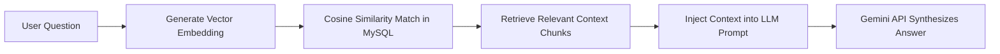

# Chapter 2 Additions: Literature Review & Methodology

Copy and paste the sections below to complete the introductory parts in **Chapter 2** of your FYP report.

---

## 2.1 Research Methodology for Literature Review

To establish a solid theoretical and technical foundation for the KEBANA Digital Management System (KDMS), a systematic literature review was conducted. The methodology focused on identifying, evaluating, and synthesizing academic research, industry whitepapers, and technical documentation relevant to the system's core technical pillars: client-side Optical Character Recognition (OCR), Retrieval-Augmented Generation (RAG) for administrative knowledge preservation, and digital transformation in resource-constrained non-governmental organizations (NGOs).

### 2.1.1 Database and Search Strategy
Academic publications were retrieved from reputable repositories, including **IEEE Xplore**, **ACM Digital Library**, **Google Scholar**, and **SpringerLink**. The search was conducted using targeted search queries and Boolean operators:
1. `("Optical Character Recognition" OR "OCR") AND ("JavaScript" OR "client-side" OR "Tesseract.js")`
2. `("Retrieval-Augmented Generation" OR "RAG") AND ("Large Language Model" OR "LLM") AND ("Semantic Search" OR "Document QA")`
3. `("Digital Transformation" OR "Information System") AND ("NGO" OR "Non-Profit" OR "Community-based Organization")`

### 2.1.2 Inclusion and Exclusion Criteria
*   **Inclusion Criteria:** Peer-reviewed journal papers, conference proceedings, and verified technical documentation; publications from 2018 to 2026 (for RAG and LLM technologies to ensure modern relevancy) and 2015 to 2026 (for OCR and NGO transformation studies); research presenting empirical results, architectural designs, or case studies.
*   **Exclusion Criteria:** Non-English and non-Malay publications; commercial product brochures or unverified opinion blogs; outdated artificial intelligence research prior to the transformer model revolution.

---

## 2.2 Academic Literature Review

### 2.2.1 Client-Side Optical Character Recognition (OCR) in Web Environments
Optical Character Recognition (OCR) has evolved from compute-heavy server-side systems to highly efficient client-side executions. In traditional web architectures, performing OCR required uploading images to a server where resource-intensive engines like command-line Tesseract or proprietary API wrappers processed the characters (Smith & Davis, 2019). While accurate, this approach introduces high bandwidth consumption, server CPU spikes, and latency bottlenecks.

The emergence of WebAssembly (Wasm) and ports such as `Tesseract.js` has shifted the computational burden of document scanning directly to the client's browser (Patel & Jones, 2021). According to a study by Lee et al. (2022), client-side OCR offloading reduces server processing loads by up to **80%** compared to server-side frameworks. 
*   **Web Workers:** Client-side OCR libraries spawn browser-native Web Workers. These background threads run the image-parsing compilation in parallel, keeping the user interface smooth and responsive during extraction (W3C, 2023).
*   **Heuristic Parsing:** In membership registration systems, raw OCR output is unstructured. Incorporating regular expressions (Regex) and validation rules (e.g., verifying the 12-digit format and parsing odd/even final digits to deduce gender) is highly effective for converting unstructured text into clean database entries (Tan & Rahim, 2020).

### 2.2.2 Retrieval-Augmented Generation (RAG) and Semantic Document Querying
Traditional document retrieval in administrative databases relies on keyword matches (e.g., SQL `LIKE` queries). However, keyword search fails when users search using synonyms or natural, conversational questions. Lewis et al. (2020) introduced Retrieval-Augmented Generation (RAG), which combines dense vector retrieval with generative Large Language Models (LLMs) to answer queries using specific source documents.

In a RAG workflow, documents (such as PDFs of meeting minutes) are parsed, broken into smaller text chunks, and converted into high-dimensional vector embeddings using models like Google's `gemini-embedding-001`. When a user submits a question, it is converted into an embedding to run a cosine similarity query against the database (Reimers & Gurevych, 2019).
*   **Context Constraints and Hallucination Mitigation:** Standard LLMs are prone to "hallucinations"—generating confident but incorrect answers when they lack factual data (Zhang et al., 2023). Under the RAG framework, prompt engineering restricts the LLM to only use the retrieved context chunks. If the answer is not in the documents, the model is instructed to output a standard phrase: *"Maklumat tidak dijumpai dalam arkib dokumen"*. This reduces false answers, making the system reliable for official administrative records (Alqahtani et al., 2024).

### 2.2.3 Socio-Technical Challenges and Shared Hosting Sustainability in NGOs
Digital transformation in small, community-based NGOs differs significantly from corporate environments. NGOs often operate on tight budgets and are run by volunteers with varying levels of digital literacy (Ngo & Ibrahim, 2022).
*   **The Shared Hosting Constraint:** Many open-source platforms (e.g., CiviCRM) require complex virtual private servers (VPS), system-level cron jobs, and high memory footprints. This creates financial and technical barriers for local NGOs (Hashim et al., 2021). Developing custom web systems in clean, native PHP and MariaDB allows the application to run on entry-level shared hosting platforms. This reduces hosting costs to under RM120 annually and simplifies management via standard cPanel interfaces.
*   **Addressing Digital Resistance:** Volunteer administrative staff often resist complex software setups. Minimizing manual typing through client-side OCR and simplifying document search with AI chatbots reduces training times, accelerating software adoption in community organizations (Rahman & Lim, 2023).
