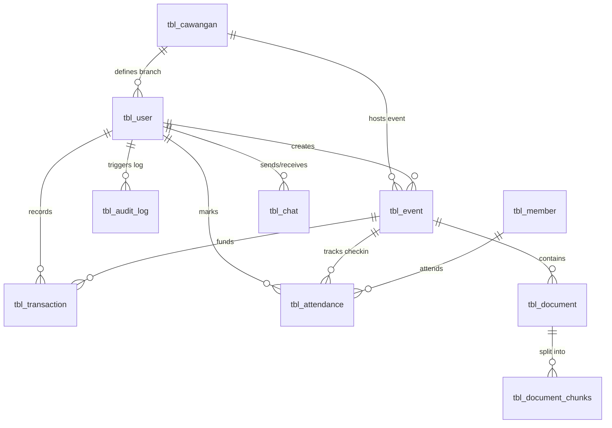

# Chapter 3 Revisions: Methodology & System Design

Copy and paste the sections below to replace or update the corresponding parts in **Chapter 3** of your FYP report.

---

## 3.4.3 Entity Relationship Diagram & Database Schema

*Replace Section 3.4.3 and all sub-sections with this comprehensive database dictionary matching your actual schema. It outlines all 12 tables, their fields, types, indexes, and primary/foreign keys.*

The database architecture for the KEBANA Digital Management System is designed using an optimized Relational Model to enforce data integrity, multi-branch data scoping, and secure logging. The database consists of 12 primary tables.

### Table 1: Branch Registry (`tbl_cawangan`)
Stores administrative branch mappings representing geographical divisions across Sarawak.
- **Primary Key (`cawangan_id`):** INT (Auto-Increment)
- **Schema Structure:**
  | Field Name | Data Type | Key / Constraint | Description |
  | :--- | :--- | :--- | :--- |
  | `cawangan_id` | INT | PRIMARY KEY | Unique branch identifier |
  | `cawangan_name` | VARCHAR(100) | NOT NULL | Name of the branch (e.g., Bintulu, Miri) |
  | `cawangan_code` | VARCHAR(20) | UNIQUE | 3-letter IATA-like code (e.g., BTU, MYY) |
  | `is_active` | TINYINT(1) | Default: 1 | Mapped active status (1: Active, 0: Disabled) |
  | `created_at` | TIMESTAMP | Default: CURRENT_TIMESTAMP | Timestamp of creation |
  | `updated_at` | TIMESTAMP | Default: CURRENT_TIMESTAMP | Timestamp of last modification |

---

### Table 2: User Account Registry (`tbl_user`)
Manages authentication credentials and branch scoping roles for active committee members.
- **Primary Key (`user_id`):** INT (Auto-Increment)
- **Foreign Key (`cawangan_id`):** Mapped to `tbl_cawangan(cawangan_id)` (Null for Central Pusat Admins)
- **Schema Structure:**
  | Field Name | Data Type | Key / Constraint | Description |
  | :--- | :--- | :--- | :--- |
  | `user_id` | INT | PRIMARY KEY | Unique user identifier |
  | `username` | VARCHAR(50) | UNIQUE, NOT NULL | Login username |
  | `password_hash` | VARCHAR(255) | NOT NULL | Secure salted password hash (BCrypt) |
  | `role` | SMALLINT | INDEX, NOT NULL | Integer role code (888: Super Admin, 1-7: Central Pusat roles, 11-66: Branch roles) |
  | `email` | VARCHAR(100) | UNIQUE, NOT NULL | Committee member email address |
  | `cawangan_id` | INT | FOREIGN KEY, NULLABLE | Enforces scoped visibility for branch users |
  | `created_at` | TIMESTAMP | Default: CURRENT_TIMESTAMP | Date user profile generated |
  | `updated_at` | TIMESTAMP | Default: CURRENT_TIMESTAMP | Date user profile modified |

---

### Table 3: Member Profile Registry (`tbl_member`)
Serves as the Single Source of Truth (SSoT) for all registered citizens and association members.
- **Primary Key (`member_id`):** INT (Auto-Increment)
- **Schema Structure:**
  | Field Name | Data Type | Key / Constraint | Description |
  | :--- | :--- | :--- | :--- |
  | `member_id` | INT | PRIMARY KEY | Unique member identifier |
  | `full_name` | VARCHAR(150) | NOT NULL | Full name matching Identity Card (IC) |
  | `ic_number` | VARCHAR(20) | UNIQUE, NOT NULL | Malaysian IC number format (YYMMDD-SS-NNNN) |
  | `village` | VARCHAR(100) | NOT NULL | Home village or longhouse location |
  | `phone_no` | VARCHAR(20) | NULLABLE | Mapped telephone contact number |
  | `status` | VARCHAR(50) | Default: 'Active' | Membership state (Active, Inactive, Pending) |
  | `created_at` | TIMESTAMP | Default: CURRENT_TIMESTAMP | Date of registration |
  | `updated_at` | TIMESTAMP | Default: CURRENT_TIMESTAMP | Date of last profile update |

---

### Table 4: Event coordination Registry (`tbl_event`)
Manages hierarchical Master and Sub events, their budgets, and the administrative approval state machine.
- **Primary Key (`event_id`):** INT (Auto-Increment)
- **Foreign Keys:**
  - `cawangan_id` linked to `tbl_cawangan(cawangan_id)`
  - `parent_event_id` self-referenced to `tbl_event(event_id)` (Allows linking branch sub-activities to master festivals)
  - `created_by` linked to `tbl_user(user_id)`
- **Schema Structure:**
  | Field Name | Data Type | Key / Constraint | Description |
  | :--- | :--- | :--- | :--- |
  | `event_id` | INT | PRIMARY KEY | Unique event identifier |
  | `event_title` | VARCHAR(150) | NOT NULL | Title of the event |
  | `event_date` | DATE | NOT NULL | Planned commencement date |
  | `event_end_date`| DATE | NULLABLE | Planned closure date |
  | `venue` | VARCHAR(150) | NOT NULL | Venue location |
  | `budget_est` | DECIMAL(10,2) | NULLABLE | Total estimated budget allocations |
  | `status` | VARCHAR(50) | Default: 'Draft' | Event lifecycle (Draft, Submitted, Approved, Rejected) |
  | `approval_status`| VARCHAR(50) | Default: 'Pending' | Current approval pipeline state (e.g. Pending President) |
  | `event_level` | ENUM('MASTER','SUB')| Default: 'MASTER' | Hierarchy level (MASTER: Festival-wide, SUB: Branch sub-event) |
  | `parent_event_id`| INT | FOREIGN KEY, NULLABLE | Connects sub-events to their parent Master event |
  | `cawangan_id` | INT | FOREIGN KEY, NULLABLE | Identifies which branch is organizing the event |
  | `created_by` | INT | FOREIGN KEY, NULLABLE | Tracks which committee user created the event |
  | `checkin_token` | VARCHAR(50) | NULLABLE | Secure dynamic token used for member QR check-in |

---

### Table 5: Document Archiving Repository (`tbl_document`)
Manages files uploaded for event proposals, approvals, minutes, and post-mortems.
- **Primary Key (`doc_id`):** INT (Auto-Increment)
- **Foreign Key (`event_id`):** Linked to `tbl_event(event_id)` (on delete cascade)
- **Schema Structure:**
  | Field Name | Data Type | Key / Constraint | Description |
  | :--- | :--- | :--- | :--- |
  | `doc_id` | INT | PRIMARY KEY | Unique document identifier |
  | `event_id` | INT | FOREIGN KEY, NULLABLE | Links document to a specific event |
  | `doc_name` | VARCHAR(150) | NOT NULL | User-defined title or original filename |
  | `file_path` | VARCHAR(255) | NOT NULL | Storage path on the server filesystem |
  | `doc_tags` | VARCHAR(255) | NULLABLE | Comma-separated search keywords for tags indexing |
  | `doc_size` | BIGINT | Default: 0 | Uploaded file size in bytes |
  | `status` | ENUM('Pending', 'Approved', 'Rejected') | Default: 'Pending' | Workflow state for document review |
  | `uploaded_at` | TIMESTAMP | Default: CURRENT_TIMESTAMP | Date file was uploaded |

---

### Table 6: AI Vector Embedding Registry (`tbl_document_chunks`)
Enables intelligent semantic search and Q&A chat capabilities by storing parsed document chunks and their mathematical vector embeddings.
- **Primary Key (`chunk_id`):** INT (Auto-Increment)
- **Foreign Key (`doc_id`):** Linked to `tbl_document(doc_id)` (on delete cascade)
- **Schema Structure:**
  | Field Name | Data Type | Key / Constraint | Description |
  | :--- | :--- | :--- | :--- |
  | `chunk_id` | INT | PRIMARY KEY | Unique chunk identifier |
  | `doc_id` | INT | FOREIGN KEY | Parent document identifier |
  | `chunk_index` | INT | Default: 0 | Ordering index of the chunk within the document |
  | `chunk_text` | TEXT | NOT NULL | Extracted plain text content block |
  | `embedding` | LONGBLOB | NOT NULL | 768-dimensional float array serialized binary representing semantic vector space |

---

### Table 7: Financial Transaction Registry (`tbl_transaction`)
Tracks all inflows (Income) and outflows (Expenses) recorded in the digital cashbook.
- **Primary Key (`trans_id`):** INT (Auto-Increment)
- **Foreign Keys:**
  - `recorded_by` linked to `tbl_user(user_id)`
  - `event_id` linked to `tbl_event(event_id)`
- **Schema Structure:**
  | Field Name | Data Type | Key / Constraint | Description |
  | :--- | :--- | :--- | :--- |
  | `trans_id` | INT | PRIMARY KEY | Unique transaction identifier |
  | `trans_type` | ENUM('Income','Expense') | NOT NULL | Transaction flow direction |
  | `amount` | DECIMAL(10,2) | NOT NULL | Monetary amount |
  | `category` | VARCHAR(100) | NOT NULL | Category classification (e.g. Food, Logistik, Grants) |
  | `trans_date` | DATE | NOT NULL | Date of financial exchange |
  | `payment_mode` | VARCHAR(50) | Default: 'Cash' | Exchange mechanism (Cash, Bank Transfer, Cheque) |
  | `receipt_path` | VARCHAR(255) | NULLABLE | Uploaded path of the payment receipt file |
  | `event_id` | INT | FOREIGN KEY, NULLABLE | Connects transaction directly to event expenditures |
  | `recorded_by` | INT | FOREIGN KEY, NULLABLE | Mapped to the Treasurer who entered the transaction |

---

### Table 8: Event Attendance Registry (`tbl_attendance`)
Records members present at local branch meetings and master festivals.
- **Primary Key (`attendance_id`):** INT (Auto-Increment)
- **Foreign Keys:**
  - `event_id` linked to `tbl_event(event_id)` (on delete cascade)
  - `member_id` linked to `tbl_member(member_id)` (on delete cascade)
  - `marked_by` linked to `tbl_user(user_id)`
- **Schema Structure:**
  | Field Name | Data Type | Key / Constraint | Description |
  | :--- | :--- | :--- | :--- |
  | `attendance_id` | INT | PRIMARY KEY | Unique log identifier |
  | `event_id` | INT | FOREIGN KEY | Mapped event |
  | `member_id` | INT | FOREIGN KEY | Mapped member |
  | `status` | ENUM('Present','Absent','Excused') | Default: 'Absent' | Attendance state |
  | `notes` | TEXT | NULLABLE | Custom check-in comments (e.g. "Self check-in via QR") |
  | `marked_by` | INT | FOREIGN KEY, NULLABLE | Mapped user who verified/marked attendance |
  | `marked_at` | TIMESTAMP | Default: CURRENT_TIMESTAMP | Check-in timestamp |

---

### Table 9: Internal Encrypted Chat (`tbl_chat`)
Facilitates secure communication between authorized committee members by storing end-to-end encrypted message strings.
- **Primary Key (`chat_id`):** INT (Auto-Increment)
- **Foreign Keys:** Sender and Receiver mapping links to `tbl_user(user_id)`
- **Schema Structure:**
  | Field Name | Data Type | Key / Constraint | Description |
  | :--- | :--- | :--- | :--- |
  | `chat_id` | INT | PRIMARY KEY | Unique message identifier |
  | `sender_id` | INT | FOREIGN KEY | Message author |
  | `receiver_id` | INT | FOREIGN KEY | Message recipient |
  | `message` | TEXT | NOT NULL | Base64-encoded encrypted text payload (AES-256-CBC) |
  | `is_read` | TINYINT(1) | Default: 0 | Status indicator (1: Read, 0: Unread) |
  | `created_at` | TIMESTAMP | Default: CURRENT_TIMESTAMP | Date and time message sent |

---

### Table 10: Security Log Registry (`tbl_audit_log`)
Monitors and logs system modifications to ensure complete tracking, data accountability, and protection against unauthorized activities.
- **Primary Key (`log_id`):** INT (Auto-Increment)
- **Foreign Key (`user_id`):** Linked to `tbl_user(user_id)` (Null for system-level actions)
- **Schema Structure:**
  | Field Name | Data Type | Key / Constraint | Description |
  | :--- | :--- | :--- | :--- |
  | `log_id` | INT | PRIMARY KEY | Unique log identifier |
  | `user_id` | INT | FOREIGN KEY, NULLABLE | Tracks which user initiated the action |
  | `action` | VARCHAR(255) | NOT NULL | Description of the action (e.g. "Log masuk berjaya") |
  | `module` | VARCHAR(100) | NOT NULL | Target system module (AUTH, MEMBERS, EVENTS, etc.) |
  | `details` | TEXT | NULLABLE | Detailed metadata regarding database state changes |
  | `ip_address` | VARCHAR(45) | NULLABLE | Client IP address tracking to audit remote access |
  | `created_at` | TIMESTAMP | Default: CURRENT_TIMESTAMP | Timestamp of action |

---

### Table 11: System Notifications (`tbl_notification`)
Displays notifications on users' dashboards.
- **Primary Key (`notification_id`):** INT (Auto-Increment)
- **Foreign Key (`user_id`):** Linked to `tbl_user(user_id)` (on delete cascade)
- **Schema Structure:**
  | Field Name | Data Type | Key / Constraint | Description |
  | :--- | :--- | :--- | :--- |
  | `notification_id`| INT | PRIMARY KEY | Unique identifier |
  | `user_id` | INT | FOREIGN KEY | Recipient of the notification |
  | `type` | VARCHAR(50) | NOT NULL | Type classification (e.g. "event_created", "branch_approved") |
  | `title` | VARCHAR(255) | NOT NULL | Short notification title |
  | `message` | TEXT | NOT NULL | Explanatory message text |
  | `link` | VARCHAR(255) | NULLABLE | Clickable navigation link (e.g. "events/view/50") |
  | `is_read` | ENUM('read','unread')| Default: 'unread' | Read status |
  | `created_at` | TIMESTAMP | Default: CURRENT_TIMESTAMP | Date triggered |

---

### Table 12: News Announcements (`tbl_announcement`)
Allows administrators to broadcast updates and event schedules.
- **Primary Key (`announcement_id`):** INT (Auto-Increment)
- **Schema Structure:**
  | Field Name | Data Type | Key / Constraint | Description |
  | :--- | :--- | :--- | :--- |
  | `announcement_id`| INT | PRIMARY KEY | Unique identifier |
  | `title` | VARCHAR(255) | NOT NULL | Title of the announcement |
  | `content` | TEXT | NOT NULL | Content payload details |
  | `expires_at` | DATETIME | NULLABLE | Date/time announcement expires and hides |
  | `status` | ENUM('Active','Draft','Inactive')| Default: 'Active' | Mapped visibility status |
  | `created_by` | INT | FOREIGN KEY, NULLABLE | Author |
  | `created_at` | DATETIME | Default: CURRENT_TIMESTAMP | Timestamp of creation |

---

## 3.5.2 Software Development Environment (Tech Stack)

*Replace Section 3.5.2 with this updated section reflecting your premium PHP/Tailwind CSS stack and modern libraries:*

To achieve the design goal of a low-cost, lightweight, yet visually stunning system, the software environment uses a robust, modular stack of web technologies:

1. **Backend Server Engine (PHP 8.x):**
   Unlike Python (Django) which requires dedicated Application Servers (like Gunicorn) and root system dependencies that complicate shared hosting, **PHP 8.x** was selected. PHP integrates natively with popular Apache/Nginx shared hosting platforms. The system is designed using a lightweight, custom-built framework incorporating clean MVC routing, centralized request filters, and robust security middleware.

2. **Frontend UI System (Tailwind CSS & Google Fonts):**
   Instead of default styles, the system implements a modern, premium design system powered by **Tailwind CSS**. It uses curated HSL colors, smooth backdrop glassmorphism styling (`backdrop-blur-sm`), custom transitions, and modern, highly legible typography powered by Google Fonts (**Outfit** and **Outfit Black**). 

3. **Client-Side Optical Character Recognition (Tesseract.js):**
   To resolve the administrative burden of volunteer manual entry, KDMS integrates **Tesseract.js** (v5). By executing the OCR text extraction directly in the client's web browser, the system offloads resource-heavy image processing from the server. This allows OCR forms to scan successfully even on lightweight shared hosting without slowing down the server.

4. **Conversational Document Query Engine (Google Gemini API):**
   The AI document search (RAG) assistant is built using the **Google Gemini API**. PDF documents uploaded by the Secretary are parsed using `smalot/pdfparser` on the server-side, divided into logical text blocks, and then converted into 768-dimensional vector representations via the `gemini-embedding-001` model. Conversational answers are generated on-demand by passing semantic matches to the `gemini-2.5-flash` model.

5. **Data Storage & PDF Generation Engines:**
   - **MariaDB / MySQL:** Used for reliable, indexed Relational Database storage.
   - **Dompdf Library:** Used to compile HTML layouts and generate clean, printable PDF financial cashbooks and statements.
   - **QRCode.js Library:** Used on the frontend to dynamically generate QR check-in codes for active events and session synchronizations.
